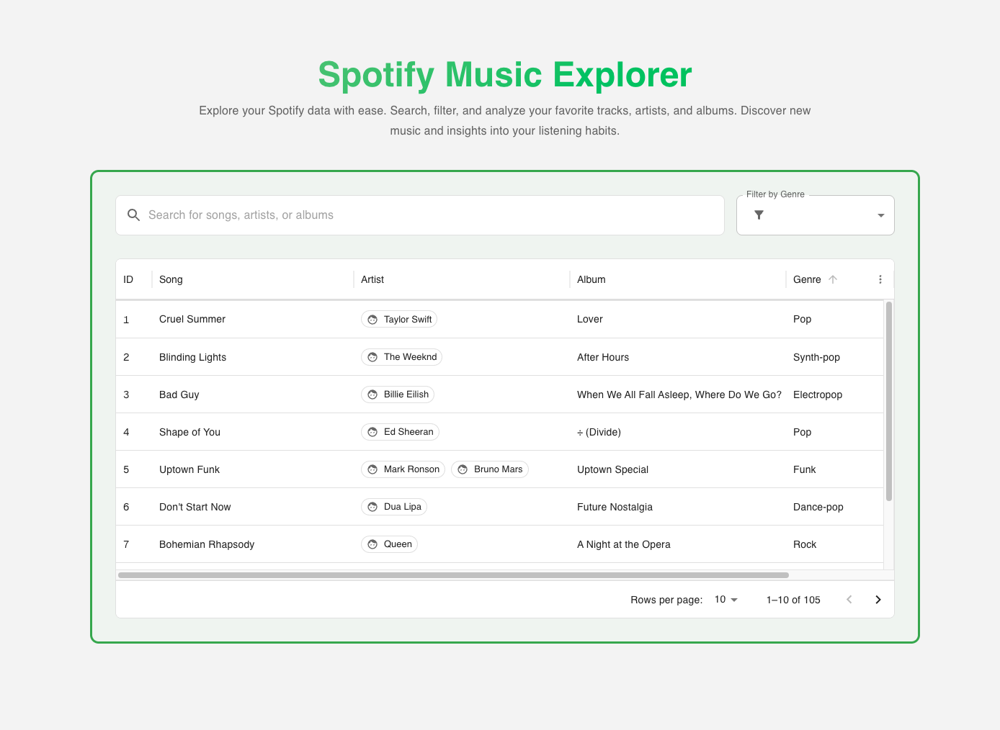

# Spotify Full Text Search


<br>

This project demonstrates a Spotify-like search functionality using Next.js, Elasticsearch, and Docker designed to showcase system design concepts for technical interviews. This application provides a modern interface to search through thousands of songs, albums, and artists, similar to the Spotify experience.

## Tech Stack

- **Frontend**: Next.js with React
- **UI Components**: Material-UI (MUI)
- **Search Engine**: Elasticsearch
- **Language**: TypeScript
- **Package Manager**: pnpm

## Prerequisites

- Node.js (v18 or higher)
- pnpm
- Elasticsearch (v9.x)
- Docker (optional, for running Elasticsearch)

## Features

- **Full-Text Search**: Search through songs, albums, and artists using Elasticsearch's powerful full-text search capabilities.
- **Advanced Filtering**: Filter search results by genre to refine your search and quickly find the content you're looking for.
- **Real-time Search**: As you type, the search results update in real-time.
- **Responsive Design**: The application is designed to be responsive and works well on both desktop and mobile devices.
- **Docker Support**: Easily run Elasticsearch using Docker for local development.

## Getting Started

### **1. Clone the repository**

```
git clone https://github.com/faridvatani/spotify-full-text-search
cd spotify-full-text-search
```

### **2. Install dependencies**

```
pnpm install
```

### **3. Start Elasticsearch**

Make sure Elasticsearch is running on `http://localhost:9200`

If using Docker:

```
docker compose up -d
```

### **4. Load the data**

```
pnpm run load-data
```

### **4. Start the development server**

```
pnpm dev
```

## Deployment
Here are some commands to help you deploy the application:
- `pnpm dev`: Start development server
- `pnpm build`: Build for production
- `pnpm start`: Start production server
- `pnpm load-data`: Load data into Elasticsearch
- `pnpm reset-data`: Delete and recreate the Elasticsearch index

## Environment Variables

To run this project, you will need to add the following environment variables to your `.env.local` file:

```
ELASTICSEARCH_URL=http://localhost:9200
```

## Implementation Details

### Search Features

- Searches across songs, albums, and artists.
- Song matches are boosted for higher relevance
- Exact phrase matching for song titles and album names
- Fuzzy matching for typo tolerance
- Minimum match threshold for better quality results

### Filtering

- Genre-based filtering using Elasticsearch aggregations
- Real-time counts of items in each genre
- Combines with text search

### Sorting

- Results are sorted by relevance when searching
- Chronological sorting (newest first) when not searching

### Data Loading

The application includes a data loading script that:

- Creates the Elasticsearch index with proper mappings
- Loads spotify data in chunks to prevent overwhelming the server
- Includes error handling and retry logic
- Shows progress during loading

### Elasticsearch Mapping

The application uses a custom Elasticsearch mapping that includes:

- Text fields with standard analyzer for better search
- Keyword fields for exact matching
- Runtime fields for genre extraction
- Custom analyzers for improved search quality

## Learn More

To learn more about Next.js, take a look at the following resources:

- [Next.js Documentation](https://nextjs.org/docs) - learn about Next.js features and API.
- [Learn Next.js](https://nextjs.org/learn) - an interactive Next.js tutorial.
- [Vercel Documentation](https://vercel.com/docs) - learn about Vercel features and API.
- [Elasticsearch Documentation](https://www.elastic.co/guide/en/elasticsearch/reference/current/index.html) - learn about Elasticsearch features and API.
- [Docker Documentation](https://docs.docker.com/) - learn about Docker features and API.
  You can check out [the Next.js GitHub repository](https://github.com/vercel/next.js) - your feedback and contributions are welcome!

## Deploy on Vercel

The easiest way to deploy your Next.js app is to use the [Vercel Platform](https://vercel.com/new?utm_medium=default-template&filter=next.js&utm_source=create-next-app&utm_campaign=create-next-app-readme) from the creators of Next.js.

Check out our [Next.js deployment documentation](https://nextjs.org/docs/app/building-your-application/deploying) for more details.

## License

This project is licensed under the MIT License. See the [LICENSE](LICENSE) file for details.

## Contributing

Contributions are welcome! Please feel free to submit a pull request or open an issue if you find any bugs or have suggestions for improvements.
